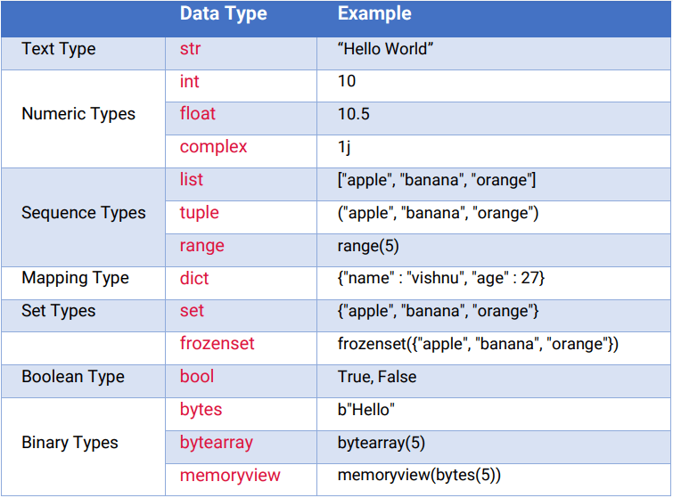
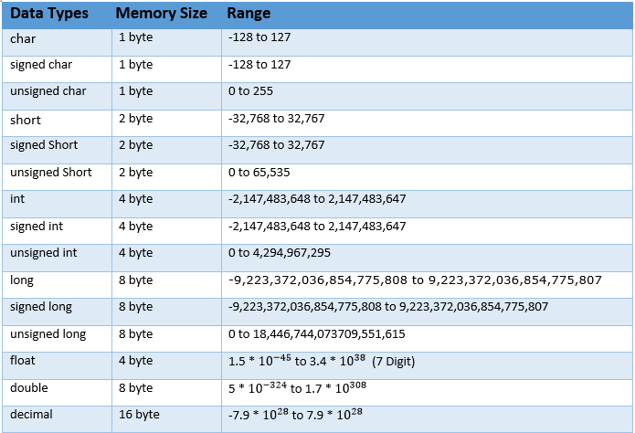
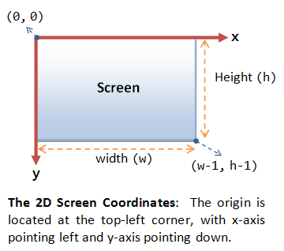

# UPN
Pozdravljen v UPN zapiskih.
https://liascript.github.io/course/?https://raw.githubusercontent.com/Pfyber/zapiskiLIA/main/UPN.md.


## Kaj je UPN?
UPN: Upravljanje programirljivih naprav.
To so vse naprave, ki jih lahko programiramo. 
Letos bomo programirali strežnike in odjemalce.

Strežnik bo praviloma na Windows/Linux sistemu.
Odjemalcec pa naprave z brskalnikom ali pa mikrokrmilnik.


Zapiski so še v izdelavi!
Napake prosim javite.

### Kontakti

**Luka Colarič**

Teams/mail: luka.colaric@sckr.si

Discord: pfyber

**Matic Ržek**

Teams/mail: matic.rzek@sckr.si

## **Katere naprave bomo letos programirali?**

Letos bomo programirali v:

- [Python](https://docs.python.org/3/)
- [JavaScript](https://developer.mozilla.org/en-US/docs/Web/JavaScript)

Oblikovali pa: 

- [CSS](https://developer.mozilla.org/en-US/docs/Web/CSS)
- [HTML](https://developer.mozilla.org/en-US/docs/Web/HTML)
- [Jinja](https://jinja.palletsprojects.com/en/3.1.x/)


Ogrodja:

- [Flask](https://flask.palletsprojects.com/en/3.0.x/)
- [MicroPython](https://micropython.org/)

Priporočeno ogrodje, ki ga sami spoznate (priporočam kakšen mesec po spoznanju Flaska)

- [Vue](https://vuejs.org/)
- [NPMjs](https://www.npmjs.com/)  pri predmetu bomo zaradi preprostosti uporabljali CDNjs


## Ideja predmeta

- Izdelava "minimalnega" spletnega Full-stack aplikacij:
  
  - strežnika(Flask) (backend)
  - baza(TinyDB)     (backend)
  - HTML, CSS, JS    (frontend)
  
- API klici (json/dict)
- Programiranje lastnega API-ja in njegova uporaba
- Programiranje  mikrokrmilniškega odjemalca
  

## Ocene predmeta
1. ocena - osnove Pythona + slovarji + APIji (november-december)
2. ocena 80% **izdelanih** vaj MicroPyhon vaj ali MicroPython test. (februar-marec)
3. ocena 80% **izdelanih** vaj Flask + **lasten projekt** ali Flask test. (maj-junij) (projekt zagovorjen do konca 1. ocenjevanja)

## Pravila predmeta

- Najpomebneje; mir in tišina - brez tega je predmet nemogoče "popolno" izepljati.
- Preden problem deliš z učiteljem. Vprašaj sošolca, vzemi si 2 minuti za premislek in 2 minuti na internetu.
- V razredu brez hrane, ko pijete pijačo se obrnite 90-180° stran od računalnika.
- chatGPT in ostali AI-ji STROGO prepovedani*! *razen, ko lahko
- Če ste končali z vsem zadanim; pomagaj sošolcem ali pa v tišini počakaj na odhod
- Slušalke po razlagi.

Še nekaj o AI pomoči:

- AI je seveda dovoljen za učenje snovi, ne pa za reševanje vaj!
- AI pomoč po resničnem razumevanju snovi! Ko pridemo do AI vaje.
- AI pomoč dovoljena pri oblikovanju (CSS), ampak šele po funkcionalnosti!
- AI omejite na pisanje max. 1 funkcionalnosti na enkrat!
- AI seveda prepovedan na ocenjevanjih!
  

**Da dosežete 80% na vajah** morate po vsaki končani vaji pokazati narejeno kjer dobite 1-3 točke.

- **0 točk** - Vaja ni pokazana ali ni opravljena ali chatGPT ali kopirana ali pa je **dijak ne zna zagovoriti**
- **1 točka** - Vaja polovično opravljena, zelo pomankljiva!
- **2 točki** - Vaja opravljena s pomankljivostmi
- **3 točke** - Vaja opravljena s potencialnim bonusom

Torej v primeru 10 vaj. 10 vaj -> max. točk 30 -> 80% = 24 točk.

- 24, 25 točk - ocena 2
- 26, 27 - ocena 3
- 28, 29 - ocena 4
- 30 - ocen 5


**V primeru odsotnosti** med pregledom vaj, je vaša dolžnost, da o tem obvestite učitelja in jih naknadno opravite.
  
Dodatne točke vedno možne, če se o tem predhodno dogovorite z enim od učiteljev.
Dodatni projekti v FabLabu in studiu vedno nagrajeni, če izpeljani korektno.

## Potrebno za predmet

- uredite si USB ključek s portable Visual Code! [Portable navodila](https://code.visualstudio.com/docs/editor/portable)
- USB ključek poimenujte ime.priimek.razred (na voljo ni veliko črk, tako da bodite izvirni)
- GitHub račun [GitHub](https://github.com/)
- preveri svojo hitrost tipkanja [Test](https://www.speedcoder.net/lessons/py/1/) - navadi se tipkovnice
- Račun na [CodeWars](https://www.codewars.com/)
- Urejanje svojih zapiskov, rešitev, ... 

Omogočanje aktivacije venv:
Set-ExecutionPolicy Unrestricted -Scope CurrentUser 


Priprava portable VS code (hvala Marcel):
- Pojdi na https://code.visualstudio.com/download in izberi .zip možnost in NUJNO IZBERI x64.
- Na USB ključek si odzipaš vsebino .zip-a.
- Ko se ti ekstrahira na USB ključek, narediš mapo “data” v mapo VSCode-win32-x64-1.93.1. Tukaj se ti bodo shranjevale vse nastavitve, extensioni…
- Zaženi code.exe


## Literatura

 - [Python docs](https://docs.python.org/3/)
 - [Flask docs](https://flask.palletsprojects.com/en/3.0.x/)
 - [Jinja docs](https://jinja.palletsprojects.com/en/3.1.x/)
 - [MicroPython docs](https://docs.micropython.org/en/latest/)
  
## Kako bo potekal pouk

Na **teoretičnih** urah bomo na začetku povadili Python, kasneje ko začnemo delati v Flasku pa bomo vsako uro našo snov nadgradili.
V tem delu se velik del dijakov zmoti, kako hitro se snov nabere brez dobrega razumevanja predhodne snovi.

Kaj naj bi že znali v Pythonu?

- Spremenljivke
- Pogojevanje
- Zanke
- Funkcije

<!-- data-type="sankey" -->
| Sankey | Spremenljivke | Pogojevanje | Zanke | Funkcije | Slovarji & klici | Flask, Micropython, TinyDB |
|:------ |:-------------:|:-----------:|:-----:|:--------:|:----------------:|:--------------------------:|
| UPN |       1      |       1      |   1    |    1      |        1.5    |            1.5            |

Vso snov 1. in 2. letnika in še mnogo novega bomo predelali v manj kot enem mesecu!
Če ste imeli v teh letnikih že težave s programiranjem, si jih prosim ne povečujte!

Na **vajah** boste delali vaje in na vas je, da vajo končate in si rešitve uredite v svoj [Notion](https://www.notion.so/).
Pred uporabo Notion pa naredite [Markdow tuturial](https://www.markdowntutorial.com/).
Ideja vaj je, da se v njih odražajo novejša snov teoretičnega dela.
**Te zapiske imate lahko na ocenjevanju.**
Pri vajah bo ponavadi prvih nekaj % ure posvečeni razlagi vaje, tu prosim poslušajte.
Ko se razlaga konča, lahko brez problema uporabljate slušake.
Delo je normalno samostojno.


**Prvih nekaj tednov bo praksa še brez vaj in bomo predelovali samo teorijo**


## FabLab in šolski studio
Jaz in prof. Ržek vodiva FabLab in šolski studio.

Ideja FabLaba je, da s pomočjo sredstev od šole dijake ustvarjajo lastne/skupinske projekte.

Ideja šolskega studia pa je, da vzpostavimo več zabave dijakom. *Zaenkrat studio išče **"resno neresne"** dijake.
Šolski discord: https://discord.gg/dJ2BG8fc , naj bi zabaval dijake. Ne najdemo animatorjev :(.

Večino projektov se da uveljaviti kot zaključno nalogo.
V začetku septembra uvodno srečanje vseh zainteresiranih.

## Uporabne spletne strani in drugo

- [W3Schools](https://www.w3schools.com/python/default.asp)
- [Geeksfg](https://www.geeksforgeeks.org/)
- [HackADay](https://hackaday.com/)
- [SlashDot](https://slashdot.org/)
- [AdaBlog](https://blog.adafruit.com/)
- [Rtings](https://www.rtings.com/)
- [Hackster](https://www.hackster.io/)
- [Spectrum](https://spectrum.ieee.org/)


Why Isn't Functional Programming the Norm? – Richard Feldman: 
!?[The Future of Programming](https://www.youtube.com/watch?v=QyJZzq0v7Z4)

# Python
## print()

`print()` je ena izmed najbolj osnovnih in pogosto uporabljenih funkcij v Pythonu. Uporablja se za izpis podatkov na zaslon ali v datoteko. Poglejmo si različne načine uporabe te vsestranske funkcije.


Najpreprostejša uporaba `print()` funkcije je izpis besedila ali vrednosti spremenljivk.

```python
print("Pozdravljen, svet!")

ime = "Ana"
starost = 25
print("Ime:", ime, "Starost:", starost)
```

Izhod:

```python
Pozdravljen, svet!
Ime: Ana Starost: 25
```

Privzeto `print()` loči argumente s presledkom. To lahko spremenimo s parametrom `sep`.

```python
print("Jabolka", "Hruške", "Banane", sep=" | ")
print("Datum:", "2024", "04", "01", sep="-")
```

Izhod:

```
Jabolka | Hruške | Banane
Datum:2024-04-01
```

Privzeto `print()` konča vrstico z novo vrstico. To lahko spremenimo s parametrom `end`.

```python
print("Ena", end=" ")
print("Dve", end=" ")
print("Tri")
```

Izhod:

```
Ena Dve Tri
```

`print()` lahko uporablja različne načine formatiranja nizov.

```python
# f-strings (Python 3.6+)
ime = "Maja"
starost = 30
print(f"{ime} je stara {starost} let.")

# .format() metoda
print("{} je stara {} let.".format(ime, starost))

# % operator (starejši način)
print("%s je stara %d let." % (ime, starost))
```

Izhod:

```
Maja je stara 30 let.
Maja je stara 30 let.
Maja je stara 30 let.
```

`print()` lahko izpiše različne tipe podatkov.

```python
print(42)  # integer
print(3.14)  # float
print(True)  # boolean
print([1, 2, 3])  # seznam
print({"ime": "Ana", "starost": 25})  # slovar
```

Izhod:

```
42
3.14
True
[1, 2, 3]
{'ime': 'Ana', 'starost': 25}
```

`print()` lahko izpisuje tudi v datoteko namesto v konzolo.

```python
with open("test.txt", "w") as f:
    print("To bo zapisano v datoteko.", file=f)
    print("Še ena vrstica v datoteki.", file=f)
```

To bo ustvarilo datoteko `test.txt` z vsebino:

```
To bo zapisano v datoteko.
Še ena vrstica v datoteki.
```

Če želimo izpisati več elementov v isto vrstico:

```python
for i in range(5):
    print(i, end=" ")
print()  # Za končno novo vrstico
```

Izhod:

```
0 1 2 3 4 
```

`print()` je pogosto uporabljen za hitro razhroščevanje kode.

```python
def seštej(a, b):
    print(f"Seštevam {a} in {b}")  # Za razhroščevanje
    rezultat = a + b
    print(f"Rezultat je {rezultat}")  # Za razhroščevanje
    return rezultat

seštej(3, 4)
```

Izhod:

```
Seštevam 3 in 4
Rezultat je 7
```

Za izpis več vrstic lahko uporabimo trojne narekovaje.

```python
print("""To je prva vrstica.
To je druga vrstica.
In to je tretja vrstica.""")
```

Izhod:

```
To je prva vrstica.
To je druga vrstica.
In to je tretja vrstica.
```

Za izpis posebnih znakov lahko uporabimo ubežne sekvence.

```python
print("Vrstica 1\nVrstica 2")
print("Tabulatorski\tpresledek")
print("Narekovaji: \"znotraj niza\"")
```

Izhod:

```
Vrstica 1
Vrstica 2
Tabulatorski	presledek
Narekovaji: "znotraj niza"
```

## Uvod v spremenljivke

V Pythonu poznamo letos uporablali naslednje osnovne tipe spremenljivk:
Po angleško seveda variables

- Integer (cela števila)
- Float (decimalna števila)
- String (nizi znakov)
- Boolean 

Od kompleksnih pa se bomo osredotočali na:

- Sezname
- Slovarje*

* edin nov tip spremenljivke
Ampak bo neverjetno pogosto uporabljen v naši snovi! 
* Objektno programiranje odvisno od hitrosti generacije.
  
Primerjava z drugimi programskimi jeziki:

Python tipi spremenljivk: 
https://dev.to/codemaker2015/python-cheatsheet-for-beginners-4ego
C# tipi spremenljivk: 
https://www.theengineeringprojects.com/2018/02/introduction-to-data-types-in-c-sharp.html
JS tipi spremeljivk: 
https://www.guvi.in/blog/guide-for-variables-and-data-types-in-javascript/

---

### **Integer (int)**

Celoštevilske vrednosti brez decimalnih mest.

Primeri:

```python
x = 5
y = -10
z = 1000000
```

Operacije:

- Aritmetične: `+`, `-`, `*`, `/`, `//` (celoštevilsko deljenje), `%` (modul), `**` (potenciranje)
- Primerjalne: `==`, `!=`, `<`, `>`, `<=`, `>=`
- Bitne: `&` (AND), `|` (OR), `^` (XOR), `~` (NOT), `<<` (levi premik), `>>` (desni premik)

Dodatno:

1. Python 3 podpira poljubno velike integers, omejene le s pomnilnikom.
2. Funkcija `type(x)` vrne `<class 'int'>`.
3. Pretvorba: `int("123")` pretvori string v integer.

Omejitve:

- Ne moremo seštevati int z drugimi tipi brez pretvorbe.

---

### **Float (float)**

Decimalna števila s plavajočo vejico.

Primeri:

```python
x = 3.14
y = -0.001
z = 2.5e6  # Znanstvena notacija: 2.5 * 10^6
```

Operacije:

- Vse operacije kot pri int.
- Dodatno: `math.floor()`, `math.ceil()`, `round()` za zaokroževanje.

Dodatno:

1. Python uporablja dvojno natančnost (64-bitov) za float.
2. Pozor na zaokroževalne napake: `0.1 + 0.2 != 0.3`

Omejitve:

- Ne moremo jih uporabiti kot indekse v seznamih ali slovarjih.

---

### **String (str)**

Nizi znakov, obdani z enojnimi ali dvojnimi narekovaji?
[PEP8](https://peps.python.org/pep-0008/)  - Najdi kaj o tem govori PEP8 in kaj sploh je PEP8?

Primeri:

```python
a = "Pozdravljen, svet!"
b = """Večvrstični
string"""
```

Operacije:

- Konkatenacija: `+`
- Ponavljanje: `*`
- Indeksiranje: `a[0]`, `a[-1]`
- Rezine: `a[1:4]`
- Metode: `.upper()`, `.lower()`, `.strip()`, `.split()`, `.join()`

Seveda jih **VSE** ostale **vsaj** preberi! 
[String metode](https://www.w3schools.com/python/python_ref_string.asp)

Dodatno:

1. Stringi so nespremenljivi (immutable). 
2. Funkcija `len(s)` vrne dolžino stringa.
3. f-stringi omogočajo vgradnjo izrazov: `f"Rezultat je {2+2}"`

Omejitve:

- Ne moremo jih odštevati ali množiti med seboj.


##### Uporabne String metode

`lower()` in `upper()`
Pretvorita niz v male oz. velike črke.

```python
pozdrav = "Živjo, Svet!"
print(pozdrav.lower())  # živjo, svet!
print(pozdrav.upper())  # ŽIVJO, SVET!

# Uporabno pri preverjanju vnosa uporabnika
uporabnikov_vnos = input("Ali želite nadaljevati? (da/ne) ").lower()
if uporabnikov_vnos == "da":
    print("Nadaljujemo!")
```

`strip()`
Odstrani presledke in nove vrstice na začetku in koncu niza.

```python
geslo = "   skrivno_geslo123\n"
ocisceno_geslo = geslo.strip()
print(f"Originalno: '{geslo}'")
print(f"Očiščeno: '{ocisceno_geslo}'")

# Uporabno pri čiščenju uporabniškega vnosa
email = input("Vnesite vaš email: ").strip()
```

`split()`
Razdeli niz na seznam podnizov glede na določen ločilni znak.

```python
stavek = "Python je super programski jezik"
besede = stavek.split()
print(besede)  # ['Python', 'je', 'super', 'programski', 'jezik']

datumi = "2023-05-15,2023-06-20,2023-07-01"
seznam_datumov = datumi.split(",")
print(seznam_datumov)  # ['2023-05-15', '2023-06-20', '2023-07-01']
```

`join()`
Združi elemente seznama v en niz, z določenim ločilom med njimi.

```python
besede = ['Python', 'je', 'super']
stavek = " ".join(besede)
print(stavek)  # Python je super

datumi = ['2023-05-15', '2023-06-20', '2023-07-01']
niz_datumov = ", ".join(datumi)
print(niz_datumov)  # 2023-05-15, 2023-06-20, 2023-07-01
```

`replace()`
Zamenja pojavitve podniza z drugim podnizom.

```python
original = "Mačka lovi miš."
novo = original.replace("miš", "ptička")
print(novo)  # Mačka lovi ptička.

# Primer z večimi zamenjavami
stevila = "1,2,3,4,5"
nova_stevila = stevila.replace(",", " | ")
print(nova_stevila)  # 1 | 2 | 3 | 4 | 5
```

`startswith()` in `endswith()`
Preverita, ali se niz začne oz. konča z določenim podnizom.

```python
datoteka = "dokument.txt"
if datoteka.endswith(".txt"):
    print("To je tekstovna datoteka.")

url = "https://www.python.org"
if url.startswith("https://"):
    print("To je varna spletna povezava.")
```

`find()` in `index()`
Najdeta indeks prve pojavitve podniza. `find()` vrne -1, če podniza ni, `index()` dvigne izjemo.

```python
email = "uporabnik@domena.com"
pozicija = email.find("@")
if pozicija != -1:
    domena = email[pozicija+1:]
    print(f"Domena: {domena}")  # Domena: domena.com

# Uporaba index() z obvladovanjem izjem
try:
    pozicija = email.index("@")
    print(f"@ je na poziciji {pozicija}")
except ValueError:
    print("Email naslov ni veljaven.")
```

`count()`
Prešteje pojavitve podniza v nizu.

```python
besedilo = "prastara prašna polica"
stevilo_pra = besedilo.count("pra")
print(f"'pra' se pojavi {stevilo_pra}-krat.")  # 'pra' se pojavi 2-krat.
```

`isalpha()`, `isdigit()`, `isalnum()`
Preverijo, ali niz vsebuje samo črke, samo številke oz. črke in številke.

```python
vnos1 = "Python3"
vnos2 = "Python"
vnos3 = "12345"

print(vnos1.isalnum())  # True
print(vnos2.isalpha())  # True
print(vnos3.isdigit())  # True

# Preverjanje veljavnosti gesla
geslo = input("Vnesite geslo (vsaj 8 znakov, vsebuje črke in številke): ")
if len(geslo) >= 8 and geslo.isalnum() and not geslo.isalpha() and not geslo.isdigit():
    print("Geslo je veljavno.")
else:
    print("Geslo ni veljavno.")
```


### **Boolean (bool)**

Logične vrednosti True ali False.

Primeri:

```python
je_soncno = True
ima_deznik = False
```

Operacije:

- Logične: `and`, `or`, `not`
- Primerjalne: `==`, `!=`

Dodatno:

1. `bool(x)` pretvori druge tipe v boolean.
2. Številčne vrednosti: `True == 1`, `False == 0`
3. Vsak neprazen objekt se obnaša kot `True` v logičnih operacijah. Kateri?
4. Obratno za prazne objekte. Kateri?

Omejitve:

- Ne moremo izvajati aritmetičnih operacij neposredno na bool vrednostih.


Dodatno za spremenljivke:

1. Python ima dinamično tipiziranje - tip spremenljivke se lahko spremeni med izvajanjem.
2. Uporaba `isinstance()` funkcije za preverjanje tipa: `isinstance(x, int)`
3. Python 3 ima tudi `complex` tip za kompleksna števila: `z = 3 + 4j`
4. `int(x)` pretvori numerične stringe in float v int.
5. Preveri še `float(x)` in `str(x)`


## Funkcije

### Kaj so funkcije?

Funkcije so zaporedja ukazov, ki jih lahko uporabimo znova in znova, ne da bi jih morali vsakič napisati na novo.

Primer:
Predstavljajte si, da vsakič, ko želite pozdraviti prijatelja, napišete:

```python
print("Zdravo, " + ime_prijatelja + "! Kako si danes?")
print("Lepo te je videti!")
```

Namesto tega lahko naredimo funkcijo:

```python
def pozdravi_prijatelja(ime):
    print("Zdravo, " + ime + "! Kako si danes?")
    print("Lepo te je videti!")

# Zdaj lahko to uporabimo večkrat:
pozdravi_prijatelja("Ana")
pozdravi_prijatelja("Bojan")
```

### Kako naredimo funkcijo?

Funkcijo naredimo z uporabo besede `def`, sledi ime funkcije in oklepaji `()`.

```python
def ime_funkcije():
    # Tukaj napišemo, kaj naj funkcija naredi
    print("Ta funkcija samo izpiše sporočilo.")

# Klic funkcije:
ime_funkcije()
```

### Funkcije s parametri

Parametri so vhodni podatki spremenljivke. Ponavadi je izhod funkcije odvisen od vhoda funkcije.
Včasih pa sploh ne.

```python
def izracunaj_starost(leto_rojstva):
    trenutno_leto = 2024
    starost = trenutno_leto - leto_rojstva
    print(f"Stari ste {starost} let.")

izracunaj_starost(1990)  # Izpiše: Stari ste 34 let.
izracunaj_starost(2000)  # Izpiše: Stari ste 24 let.
```

### Vračanje vrednosti

Funkcije lahko tudi vrnejo rezultat, ki ga lahko shranimo ali uporabimo.

```python
def sestej(a, b):
    vsota = a + b
    return vsota

rezultat = sestej(5, 3)
print(rezultat)  # Izpiše: 8

# Lahko tudi direktno uporabimo:
print(sestej(10, 20))  # Izpiše: 30
```

### Privzete vrednosti parametrov

Včasih želimo, da ima parameter neko privzeto vrednost, če je ne podamo.

```python
def pozdravi(ime="prijatelj"):
    print(f"Pozdravljen, {ime}!")

pozdravi("Ana")  # Izpiše: Pozdravljen, Ana!
pozdravi()  # Izpiše: Pozdravljen, prijatelj!
```

### Več parametrov

Funkcije lahko sprejmejo več parametrov.

```python
def opisi_osebo(ime, starost, najljubša_barva):
    print(f"{ime} je star/a {starost} let.")
    print(f"Njegova/njena najljubša barva je {najljubša_barva}.")

opisi_osebo("Maja", 25, "modra")
```

### Funkcije znotraj funkcij

Funkcije lahko kličemo znotraj drugih funkcij.

```python
def izracunaj_kvadrat(število):
    return število ** 2

def izračunaj_in_izpisi_kvadrat(število):
    rezultat = izracunaj_kvadrat(število)
    print(f"Kvadrat števila {število} je {rezultat}.")

izracunaj_in_izpisi_kvadrat(5)  # Izpiše: Kvadrat števila 5 je 25.
```


#### Lambda funkcije

Lambda funkcije so majhne anonimne (brez imena) funkcije. Uporabne so za kratke operacije.

```python
# Navadna funkcija
def kvadriraj(x):
    return x ** 2

# Enaka lambda funkcija
kvadriraj_lambda = lambda x: x ** 2

print(kvadriraj(5))        # Izpiše: 25
print(kvadriraj_lambda(5)) # Izpiše: 25
```

#### Funkcije kot argumenti

Funkcije lahko pošljemo kot argumente drugim funkcijam.

```python
def uporabi_funkcijo(func, število):
    return func(število)

def podvoji(x):
    return x * 2

def kvadriraj(x):
    return x ** 2

print(uporabi_funkcijo(podvoji, 5))   # Izpiše: 10
print(uporabi_funkcijo(kvadriraj, 5)) # Izpiše: 25
```


### Vaje osnovni tipi in funkcije


- [Return negative](https://www.codewars.com/kata/55685cd7ad70877c23000102)
- [Opposite](https://www.codewars.com/kata/56dec885c54a926dcd001095)
- [Str to int](https://www.codewars.com/kata/544675c6f971f7399a000e79)
- [Multiply the number](https://www.codewars.com/kata/5708f682c69b48047b000e07) -preveri string metode


- [Upper](https://www.codewars.com/kata/57a0556c7cb1f31ab3000ad7)
- [Abbriviate](https://www.codewars.com/kata/57eadb7ecd143f4c9c0000a3)
- [Years](https://www.codewars.com/kata/586c1cf4b98de0399300001d) (IFi)
- [Reverse](https://www.codewars.com/kata/57a55c8b72292d057b000594)  (preveri split in join)


## Pogoji (IF stavki)


Pogoji v Pythonu omogočajo izvajanje različnih blokov kode glede na določene okoliščine. Python ponuja več načinov za izražanje pogojev, od osnovnih if-else stavkov do bolj naprednih tehnik.

### If-Else stavki

Osnovni način za izvajanje kode na podlagi pogojev.

Primeri:

```python
# Osnovni if-else
starost = 18
if starost >= 18:
    print("Polnoleten")
else:
    print("Mladoleten")

# If-elif-else
ocena = 75
if ocena >= 90:
    print("Odlično")
elif ocena >= 80:
    print("Prav dobro")
elif ocena >= 70:
    print("Dobro")
else:
    print("Zadostno")

# Gnezdeni if stavki
temperatura = 25
vlaznost = 60
if temperatura > 20:
    if vlaznost > 50:
        print("Toplo in vlažno")
    else:
        print("Toplo in suho")
else:
    print("Hladno")
```

Operacije:

- Preverjanje enega ali več pogojev
- Izvajanje različnih blokov kode glede na pogoje
- Gnezdenje pogojev

Dodatno:

1. Python uporablja zamike za določanje blokov kode. Enako pri funkcijah, objektih in zankah.
2. Lahko uporabimo `pass` stavek za prazen blok kode.
3. If preveri vse pogoje, medtem ko elif preveri samo, dokler ne najde prvega resničnega pogoja. Če je en elif resničen, ostali pogoji v verigi niso preverjeni.


Omejitve:

- Preveč gnezdenih if stavkov lahko poslabša berljivost kode. 


### Pogojni izrazi (Ternary Operators)

Kompaktna oblika if-else stavkov v eni vrstici.

Primeri:

```python
# Osnovni pogojni izraz
x = 5
rezultat = "Sodo" if x % 2 == 0 else "Liho"

# Uporaba v funkcijah
def abs_vrednost(x):
    return x if x >= 0 else -x

# Gnezdeni pogojni izrazi
y = 10
opis = "Pozitivno in sodo" if y > 0 and y % 2 == 0 else "Pozitivno in liho" if y > 0 else "Negativno ali nič"

# Uporaba s seznamskim razumevanjem (list comprehansion)
stevila = [1, 2, 3, 4, 5]
parnost = ["Sodo" if n % 2 == 0 else "Liho" for n in stevila]

**NUJNO SE NAUČI IDEJO LIST COMPREHANSIONA**, seveda jo bomo omenili še nekajkrat.
Ampak zna priti zelo prav, ko želimo estetsko kodo.

```

Dodatno:

1. Omogočajo pisanje kompaktne kode za enostavne pogojne operacije.
2. Pogosto se uporabljajo v seznamskih razumevanjih in lambda funkcijah. 
3. Lahko izboljšajo berljivost za enostavne pogojne dodelitve.

Omejitve:

- Niso primerni za kompleksne pogoje ali več kot dve možni vrednosti.

---

### Logični operatorji

Uporabljajo se za kombiniranje in manipuliranje logičnih vrednosti.

Primeri:

```python
# Uporaba and, or, not
x, y = 5, 10
if x > 0 and y < 20:
    print("Oba pogoja sta izpolnjena")

if x < 0 or y > 5:
    print("Vsaj en pogoj je izpolnjen")

if not x > 10:
    print("x ni večji od 10")

# "short-circuit" vrednotenje
a = None
b = "Privzeto"
rezultat = a or b  # Vrne "Privzeto"

# Veriženje primerjava
if 0 < x < 10:
    print("x je med 0 in 10")
```

Operacije:

- Kombiniranje več pogojev
- Negacija pogojev
- Veriženje


Dodatno:

1. Operatorji `and` in `or` uporabljajo short-cirtcuit vrednotenje.
2. Logični operatorji lahko vrnejo tudi ne-boolove vrednosti**

```python

# **primeri ne direktno-boolove vrednosti
# Prazen operator
x = 0 ali [] ali "" ali None
if x:
  print("X ne obstaja")

# Operator 'or'
a = "" or "Privzeto"
print(a)  # Izpiše: Privzeto

# Kompleksnejši primer
def get_display_name(user):
    return user.nickname or user.username or user.email or "Anonimnež"

```

### Match stavki (Python 3.10+)

Strukturirano preverjanje vzorcev, podobno switch stavkom v drugih jezikih.

Primeri:

```python
# Osnovni match stavek
status = 404
match status:
    case 400:
        print("Bad request")
    case 404:
        print("Not found")
    case 418:
        print("I'm a teapot")
    case _:
        print("Something's wrong with the internet")

# Match s pogoji
command = "quit"
match command:
    case "quit" | "exit":
        print("Izhod iz programa")
    case "restart" if povezava_aktivna:
        print("Ponovni zagon")
    case str() as unknown_command:
        print(f"Neznani ukaz: {unknown_command}")

# Razstavljanje struktur
point = (3, 4)
match point:
    case (0, 0):
        print("Izhodišče")
    case (0, y):
        print(f"Y os, y={y}")
    case (x, 0):
        print(f"X os, x={x}")
    case (x, y):
        print(f"Točka: ({x}, {y})")
    case _:
        print("Ni točka")
```

Operacije:

- Preverjanje vrednosti proti več vzorcem
- Razstavljanje struktur (tuple, list, dict)
- Kombiniranje vzorcev s pogoji

Dodatno:

1. Uvedeno v Python 3.10 kot alternativa kompleksnim if-elif verigam.
2. Omogoča elegantno obravnavo kompleksnih podatkovnih struktur.
3. Podpira "ali" vzorce z uporabo `|`.

Omejitve:

- Na voljo samo v Python 3.10 in novejših verzijah.
- Ne podpira padanja skozi primere (fall-through) kot switch v nekaterih drugih jezikih.


[Leap year](https://www.codewars.com/kata/526c7363236867513f0005ca)
[Horoscope](https://www.codewars.com/kata/57a73e697cb1f31dd70000d2)
[Credit card](https://www.codewars.com/kata/5412509bd436bd33920011bc)


### Vaje IF 

- [Born in](https://www.codewars.com/kata/5761a717780f8950ce001473)
- [DNA to RNA](https://www.codewars.com/kata/5556282156230d0e5e000089)
- [Dating range](https://www.codewars.com/kata/5803956ddb07c5c74200144e)
- [Cat&Dog years](https://www.codewars.com/kata/5a6663e9fd56cb5ab800008b)
- [Banjo](https://www.codewars.com/kata/53af2b8861023f1d88000832)
- [Opposites Atract](https://www.codewars.com/kata/555086d53eac039a2a000083)

### **Seznam (list)**

Urejeno zaporedje elementov, ki so lahko različnih tipov.
Zelo zelo sorodni tip spremenljivki string.
Kaj vse imata skupnega v Pythonu?

Primeri:

```python
a = [1, 2, 3, 4, 5]
b = ['a', 'b', 'c']
c = [1, 'dva', 3.0, [4, 5]]
```

Operacije:

- Indeksiranje: `a[0]`, `a[-1]`
- Rezine: `a[1:4]`
- Konkatenacija: `+`
- Ponavljanje: `*`
- Metode: `.append()`, `.extend()`, `.insert()`, `.remove()`, `.pop()`, `.sort()`

Preveri še vse metode seznama:
[Metode seznama](https://www.w3schools.com/python/python_ref_list.asp)

Dodatno:

1. Seznami so spremenljivi (mutable).
2. Funkcija `len(a)` vrne število elementov v seznamu. 
3. Seznam lahko vsebuje elemente različnih tipov, vključno z drugimi seznami.

Omejitve:

- Indeksi morajo biti celoštevilski.

### **Množica (set)**

Neurejena zbirka unikatnih elementov.
Ne uproabljajo se pogosto, so pa zelo prirorčni zaradi ne ponavljanja in zaradi funkcij nad množicami.

Primeri:

```python
a = {1, 2, 3, 4, 5}
b = set([1, 2, 2, 3, 3, 3])  # Rezultat: {1, 2, 3}
c = set()  # Prazna množica
```

Operacije:

- Dodajanje: `.add()`, `.update()`
- Odstranjevanje: `.remove()`, `.discard()`, `.pop()`
- Množične operacije: `|` (unija), `&` (presek), `-` (razlika), `^` (simetrična razlika)

Dodatno:

1. Množice ne vsebujejo podvojenih elementov.
2. Elementi množice morajo biti nespremenljivi (hashable).
3. Množice so zelo učinkovite za preverjanje članstva: `if x in s`


Omejitve:

- Ne moremo dostopati do elementov z indeksi.
- Ne morejo vsebovati spremenljivih elementov (npr. seznamov).

---


**N-terica (tuple)**

Nespremenljivo zaporedje elementov.

Primeri:

```python
a = (1, 2, 3)
b = ('a', 'b', 'c')
c = (1,)  # Enoelementna n-terica potrebuje vejico
```

Operacije:

- Indeksiranje: `a[0]`, `a[-1]`
- Rezine: `a[1:4]`
- Konkatenacija: `+`
- Ponavljanje: `*`

Dodatno:

1. N-terice so nespremenljive (immutable).
2. Pogosto se uporabljajo za vračanje več vrednosti iz funkcij.
3. Lahko vsebujejo elemente različnih tipov.

Omejitve:

- Ne moremo spreminjati elementov po ustvarjanju.

---

**Slovar (dict)**

Zbirka parov ključ-vrednost.

Primeri:

```python
a = {'ime': 'Janez', 'starost': 30}
b = dict(barva='rdeča', število=5)
c = {x: x**2 for x in range(5)}  # Slovarsko razumevanje
```

Operacije:

- Dostop do vrednosti: `a['ime']`, `a.get('ime')`
- Dodajanje/spreminjanje: `a['novo'] = 'vrednost'`
- Brisanje: `del a['ključ']`
- Metode: `.keys()`, `.values()`, `.items()`, `.update()`

Dodatno:

1. Od Python 3.7 naprej slovarji ohranjajo vrstni red vnosa.
2. Ključi morajo biti nespremenljivi (hashable).
3. Zelo učinkoviti za iskanje vrednosti po ključu.

Omejitve:

- Ključi morajo biti unikatni.
- Ključi ne morejo biti spremenljivi objekti (npr. seznami).
- 
## Seznami

Seznami so ena najpogosteje uporabljenih podatkovnih struktur v Pythonu. So urejene, spremenljive zbirke elementov, ki lahko vsebujejo elemente različnih tipov.


### Ustvarjanje seznamov

Sezname lahko ustvarimo na več načinov.

Primeri:

```python
# Prazen seznam
prazen = []

# Seznam s elementi
stevila = [1, 2, 3, 4, 5]

# Seznam z mešanimi tipi
mesani = [1, "dva", 3.0, [4, 5]]

# Ustvarjanje s funkcijo list()
beseda = list("Python")  # ['P', 'y', 't', 'h', 'o', 'n']

# List comprehension
kvadrati = [x**2 for x in range(5)]  # [0, 1, 4, 9, 16]

# Množenje seznama
ponovitve = [0] * 5  # [0, 0, 0, 0, 0]
```

Operacije:

- Ustvarjanje praznih in nepraznih seznamov
- Pretvorba drugih zbirk v sezname (recimo string, range(), set, ... )
- Ustvarjanje seznamov uproaba list comprehension-a.

Dodatno:

1. Seznami lahko vsebujejo elemente različnih tipov, vključno z drugimi seznami!
2. List comprehantion je pogosto hitrejši od enakovredne zanke for.
3. Pri množenju seznama se ustvari nov seznam s ponovitvami referenc na elemente.

Omejitve:

- Velika poraba spomina pri zelo dolgih seznamih.

---

### Dostop do elementov in rezine (slice)

Python omogoča fleksibilen dostop do elementov seznama.
Vsa ideja rezin deluje tudi na stringih!
Primeri:

```python
seznam = [10, 20, 30, 40, 50]

# Dostop do posameznih elementov
prvi = seznam[0]  # 10
zadnji = seznam[-1]  # 50

# Rezine
prvih_trije = seznam[:3]  # [10, 20, 30]
zadnji_trije = seznam[-3:]  # [30, 40, 50]
vsak_drugi = seznam[::2]  # [10, 30, 50]

# Obrnjen seznam
obrnjeno = seznam[::-1]  # [50, 40, 30, 20, 10]

# Kopiranje seznama
kopija = seznam[:]
```

Operacije:

- Indeksiranje (pozitivno in negativno)
- Rezine z začetnim indeksom, končnim indeksom in korakom
- Obračanje seznama
- Plitko kopiranje seznama

Dodatno:

1. Negativni indeksi štejejo od konca seznama.
2. Rezine ustvarijo nov seznam (kopijo).
3. Korak v slicu lahko uporabimo za preskakovanje elementov ali obračanje seznama.

Omejitve:

- Dostop do neobstoječega indeksa povzroči IndexError. Kako mimo njega?

---

### Spreminjanje seznamov

Seznami so spremenljivi, kar omogoča njihovo prilagajanje po ustvarjanju.

Primeri:

```python
seznam = [1, 2, 3, 4, 5]

# če smo leni
seznam = list(range(1,6))

# Spreminjanje posameznega elementa
seznam[2] = 30  # [1, 2, 30, 4, 5]

# Dodajanje elementov
seznam.append(6)  # [1, 2, 30, 4, 5, 6]
seznam.extend([7, 8])  # [1, 2, 30, 4, 5, 6, 7, 8]
seznam.insert(1, 15)  # [1, 15, 2, 30, 4, 5, 6, 7, 8]
seznam.insert([1, 15])  # [2, 30, 4, 5, 6, 7, 8, [1,15]]

# Odstranjevanje elementov
seznam.remove(30)  # Odstrani prvo pojavitev 30
odstranjeno = seznam.pop()  # Odstrani in vrne zadnji element
del seznam[1]  # Odstrani element na indeksu 1

# Rezine za spreminjanje
seznam[1:4] = [20, 21, 22]  # Zamenja elemente od indeksa 1 do 3
```

Operacije:

- Spreminjanje elementov s prireditvijo
- Dodajanje elementov (append, extend, insert)
- Odstranjevanje elementov (remove, pop, del)
- Spreminjanje več elementov hkrati z rezinami

Dodatno:

1. Metoda `extend()` je učinkovitejša od zaporednih `append()` klicev.
2. `del` lahko odstrani tudi rezine seznama.
3. Spreminjanje seznama med iteracijo lahko povzroči nepričakovane rezultate.

---

### Operacije in metode seznamov

Python ponuja številne vgrajene operacije in metode za delo s seznami.

Primeri:

```python
a = [1, 2, 3]
b = [4, 5, 6]

# Združevanje seznamov
c = a + b  # [1, 2, 3, 4, 5, 6]

# Ponavljanje seznama
ponovljen = a * 3  # [1, 2, 3, 1, 2, 3, 1, 2, 3]

# Dolžina seznama
dolzina = len(a)  # 3

# Iskanje
indeks = a.index(2)  # 1
stevilo_trojk = a.count(3)  # 1

# Sortiranje
a.sort()  # Sortira seznam na mestu (destruktivno)
sortirano = sorted(b)  # Vrne nov sortiran seznam

# Obračanje
a.reverse()  # Obrne seznam na mestu

# Čiščenje seznama
a.clear()  # Odstrani vse elemente
```

Operacije:

- Združevanje in ponavljanje seznamov
- Iskanje elementov in indeksov
- Sortiranje in obračanje
- Čiščenje seznama

Dodatno:

1. Operacija `+` ustvari nov seznam, medtem ko `extend()` spremeni obstoječega.
2. Metoda `sort()` spremeni original, `sorted()` pa vrne novo kopijo.
3. `clear()` je ekvivalentno `del a[:]`, bojda je bolj berljivo.

Omejitve:
- Sortiranje deluje samo, če so elementi primerljivi med seboj.

---

### Napredne tehnike

Seznami omogočajo tudi bolj napredne operacije in tehnike.
Pa smo tukaj! List comprehension!!!

Vseeno lažje kot regex :).
Primeri:

```python


# Prvo brez!
sodi = []
for x in range(10):
  if x % 2 == 0:
    sodi.append(x)

# List comprehensions pogoji
sodi = [x for x in range(10) if x % 2 == 0]  # [0, 2, 4, 6, 8]

# Lahko jih tudi seštejemo
sodi = sum([x for x in range(10) if x % 2 == 0])  # 20


# Ali pa najdemo max
sodi = max([x for x in range(10) if x % 2 == 0])  # 8


# Zipanje seznamov
imena = ["Ana", "Bor", "Cene"]
ocene = [5, 4, 3]
pari = list(zip(imena, ocene))  # [("Ana", 5), ("Bor", 4), ("Cene", 3)]

# Tole spodaj ne bo nikoli na testu. 

# Gnezden list comprehension
matrika = [[i*j for j in range(5)] for i in range(5)]
# Filtriranje s filter()
nad_pet = list(filter(lambda x: x > 5, [3, 7, 2, 8, 1, 9, 4]))

# Preslikava z map()
kvadrirano = list(map(lambda x: x**2, [1, 2, 3, 4, 5]))

# Reduciranje s functools.reduce()
from functools import reduce
produkt = reduce(lambda x, y: x * y, [1, 2, 3, 4, 5])  # 120
```

Operacije:

- Napredno seznam razumevanje
- Kombiniranje seznamov
- Funkcionalno programiranje s seznami

Dodatno:

1. Seznam razumevanje lahko nadomesti `map()` in `filter()` v mnogih primerih.
2. `zip()` je uporaben za vzporedno iteracijo po več seznamih.
3. `reduce()` omogoča kumulativne operacije nad seznamom.

Omejitve:

- Pretirano zapleteni izrazi v seznam razumevanju lahko poslabšajo berljivost.


## Zanke

Zanke so ključni koncept v programiranju, ki omogočajo ponavljanje določenih delov kode. Python ponuja dve glavni vrsti zank: `for` in `while`.

### For zanka

For zanka se uporablja za iteracijo čez zaporedje (npr. seznam, niz, slovar) ali kateri koli iterabilni objekt.


```python
for element in zaporedje:
    # koda, ki se izvede za vsak element
```

Primeri:

```python
# Iteracija čez seznam
for število in [1, 2, 3, 4, 5]:
    print(število)

# Iteracija čez niz
for črka in "Python":
    print(črka)

# Uporaba range() funkcije
for i in range(5):
    print(i)  # Izpiše števila od 0 do 4

# Iteracija čez slovar
slovar = {"a": 1, "b": 2, "c": 3}
for ključ in slovar:
    print(f"Ključ: {ključ}, Vrednost: {slovar[ključ]}")

# Alternativno za slovarje
for ključ, vrednost in slovar.items():
    print(f"Ključ: {ključ}, Vrednost: {vrednost}")
```

### Napredne tehnike

1. Enumerate:
```python
for indeks, element in enumerate(["a", "b", "c"]):
    print(f"Indeks: {indeks}, Element: {element}")
```

2. Zip za vzporedno iteracijo:
```python
imena = ["Ana", "Bor", "Cene"]
ocene = [5, 4, 3]
for ime, ocena in zip(imena, ocene):
    print(f"{ime} ima oceno {ocena}")
```

3. List comprehension (seznam razumevanje):
```python
kvadrati = [x**2 for x in range(10)]
```

## While zanka

While zanka se izvaja, dokler je določen pogoj resničen.

### Osnovna sintaksa

```python
while pogoj:
    # koda, ki se izvaja, dokler je pogoj resničen
```

Primeri:

```python
# Osnovna while zanka
števec = 0
while števec < 5:
    print(števec)
    števec += 1

# While zanka z break
while True:
    vnos = input("Vnesite število (ali 'q' za izhod): ")
    if vnos == 'q':
        break
    print(f"Vnesli ste: {vnos}")

# While zanka s continue
števec = 0
while števec < 10:
    števec += 1
    if števec % 2 == 0:
        continue
    print(števec)  # Izpiše samo liha števila
```

### Kontrolne izjave

- `break`: Prekine izvajanje zanke
- `continue`: Preskoči preostanek trenutne iteracije in nadaljuje z naslednjo
- `else`: Izvede se, ko se zanka zaključi normalno (brez break)

Primer:

```python
for število in range(10):
    if število == 5:
        break
    print(število)
else:
    print("Zanka se je zaključila normalno")
# Zanka se prekine pri 5, zato se else blok ne izvede
```

### Gnezdene zanke

Zanke lahko gnezdimo eno znotraj druge.

Primer:

```python
for i in range(3):
    for j in range(3):
        print(f"({i}, {j})")
```

Dodatno:

1. For zanke so običajno hitrejše in bolj berljive od while zank za iteracijo čez znana zaporedja.
2. While zanke so koristne, ko ne vemo vnaprej, kolikokrat se bo zanka izvedla.
3. Izogibajte se neskončnim zankam (razen če so namerne).
4. Uporabite `enumerate()`, ko potrebujete tako indeks kot vrednost elementa.
5. List comprehension je pogosto hitrejši od enakovredne for zanke.

Omejitve:

- Spreminjanje zaporedja med iteracijo lahko povzroči nepričakovane rezultate.
- Previdno pri uporabi float vrednosti v pogojih while zank zaradi možnih napak pri zaokroževanju.
- 
### Vaje zanke 

**TODO oznake spodaj se ne shranjujejo!**


- [ ] [Min Max](https://www.codewars.com/kata/554b4ac871d6813a03000035)  (prvo reši na dolg način, potem pa z min max funckijo)
- [ ] [Without min max](https://www.codewars.com/kata/576b93db1129fcf2200001e6)
- [ ] [Map](https://www.codewars.com/kata/57f781872e3d8ca2a000007e) (one-line prosim)
- [ ] [Double every other](https://www.codewars.com/kata/5809c661f15835266900010a)
- [ ] [New member](https://www.codewars.com/kata/5502c9e7b3216ec63c0001aa)
- [ ] [Friends](https://www.codewars.com/kata/55b42574ff091733d900002f)
- [ ] [Count pos sum neg](https://www.codewars.com/kata/576bb71bbbcf0951d5000044) (poskusi z 2 list comprehantion-a)
- [ ] [Range](https://www.codewars.com/kata/5513795bd3fafb56c200049e)
- [ ] [Mumbling](https://www.codewars.com/kata/5667e8f4e3f572a8f2000039) (enumerate in množenje stringov*)
- [ ] [Poker](https://www.codewars.com/kata/5acbc3b3481ebb23a400007d)
- [ ] [Flowers](https://www.codewars.com/kata/606efc6a9409580033837dfb)
- [ ] [Sheeps](https://www.codewars.com/kata/5b077ebdaf15be5c7f000077) (online)
- [ ] [Double char](https://www.codewars.com/kata/56b1f01c247c01db92000076) (nekam znano)
- [ ] [Thinkful](https://www.codewars.com/kata/586e1d458cb711f0a800033b)
- [ ] [Inverse slicing](https://www.codewars.com/kata/586ec0b8d098206cce001141)
- [ ] [Astro](https://www.codewars.com/kata/624e0a4c3e1d7b0031588666)
- [ ] [Mexican wave](https://www.codewars.com/kata/58f5c63f1e26ecda7e000029)
- [ ] [Camel case](https://www.codewars.com/kata/517abf86da9663f1d2000003) (replace().replace().split()  hmmm??)
- [ ] [Bob](https://www.codewars.com/kata/5751fef5dcc1079ac5001cff) 
  

  še malo ljubezni za while:

  - [Population](https://www.codewars.com/kata/563b662a59afc2b5120000c6)


## Slovarji

Slovarji so zelo uporabna in prilagodljiva podatkovna struktura v Pythonu. Omogočajo shranjevanje parov ključ-vrednost in hitro iskanje vrednosti po ključu.


### Ustvarjanje slovarjev

Slovarje lahko ustvarimo na več načinov.

Primeri:

```python
# Prazen slovar
prazen = {}

# Slovar s pari ključ-vrednost
oseba = {"ime": "Ana", "starost": 30, "mesto": "Ljubljana"}

# Uporaba dict() konstruktorja
barve = dict(rdeča="#FF0000", zelena="#00FF00", modra="#0000FF")

# Slovarsko razumevanje
kvadrati = {x: x**2 for x in range(5)}  # {0: 0, 1: 1, 2: 4, 3: 9, 4: 16}

# Ustvarjanje iz seznamov
kljuci = ["a", "b", "c"]
vrednosti = [1, 2, 3]
abecedni = dict(zip(kljuci, vrednosti))  # {"a": 1, "b": 2, "c": 3}
```


```python
# izdelaj dict = {"ime": ITM, ...} za vse elemente sezname imen... ITM = teža / (višina)*2 ... višina v metrih!
imena = ["Ana", "Boris", "Cene"]
meritve = [[1.65, 60], [1.80, 75], [1.75, 85]]  # [visina, teža]
```

Operacije:

- Ustvarjanje praznih in nepraznih slovarjev
- Uporaba različnih konstruktorjev
- Slovarsko razumevanje
- Ustvarjanje iz seznamov ključev in vrednosti

Dodatno:

1. Ključi morajo biti nespremenljivi (hashable) tipi.
2. Od Python 3.7 naprej slovarji ohranjajo vrstni red vnosa.

Omejitve:

- Ključi morajo biti unikatni; ponovljen ključ prepiše prejšnjo vrednost.


### Dostop do elementov in spreminjanje

Python omogoča fleksibilen dostop in spreminjanje elementov slovarja.

Primeri:

```python
slovar = {"a": 1, "b": 2, "c": 3}

# Dostop do vrednosti
vrednost = slovar["a"]  # 1
vrednost_ali_privzeto = slovar.get("d", 0)  # Vrne 0, če ključ ne obstaja

# Spreminjanje in dodajanje elementov
slovar["b"] = 20  # Spremeni obstoječo vrednost
slovar["d"] = 4  # Doda nov par ključ-vrednost

# Brisanje elementov
del slovar["c"]  # Izbriše par ključ-vrednost

odstranjeno = slovar.pop("b")  # Odstrani in vrne vrednost


# Množično posodabljanje
slovar.update({"f": 6, "g": 7})  # Doda ali posodobi več parov hkrati

Operacije:

- Dostop do vrednosti po ključu
- Spreminjanje obstoječih vrednosti
- Dodajanje novih parov ključ-vrednost
- Brisanje elementov
- Varno dodajanje in posodabljanje

Dodatno:

1. Metoda `get()` je varnejša od neposrednega dostopa, ker ne povzroči napake za neobstoječ ključ.
2. `update()` lahko sprejme drug slovar ali iterabilni objekt parov ključ-vrednost.

Omejitve:

- Dostop do neobstoječega ključa z oglatimi oklepaji povzroči KeyError.
```

### Iteracija po slovarjih

Python ponuja več načinov za iteracijo po slovarjih.

Primeri:

```python

slovar = {"a": 1, "b": 2, "c": 3}

# Iteracija po ključih
for kljuc in slovar:
    print(kljuc)

# Iteracija po vrednosti preko ključa?
for kljuc in slovar:
    print(slovar[kljuc])

# Iteracija po vrednostih
for vrednost in slovar.values():
    print(vrednost)

# Iteracija po parih ključ-vrednost
for kljuc, vrednost in slovar.items():
    print(f"{kljuc}: {vrednost}")

# Razpakiranje v zanki for
for kljuc, vrednost in slovar.items():
    print(f"Ključ {kljuc} ima vrednost {vrednost}")

# Seznam ključev, vrednosti in parov
kljuci = list(slovar.keys())
vrednosti = list(slovar.values())
pari = list(slovar.items())
```


Operacije:

- Iteracija po ključih, vrednostih ali parih
- Pretvorba pogledov slovarja v sezname

Dodatno:

1. Privzeta iteracija po slovarju je iteracija po ključih.
2. Metode `keys()`, `values()` in `items()` vračajo dinamične poglede na slovar.

Omejitve:

- Spreminjanje velikosti slovarja med iteracijo lahko povzroči napako.

---

### Napredne tehnike in operacije

Slovarji omogočajo tudi bolj napredne operacije in tehnike.

Primeri:

```python
# Združevanje slovarjev (Python 3.9+)
slovar1 = {"a": 1, "b": 2}
slovar2 = {"b": 3, "c": 4}
zdruzeno = slovar1 | slovar2  # {"a": 1, "b": 3, "c": 4}

# Slovarsko razumevanje (comprehansion) s pogoji
sodi_kvadrati = {x: x**2 for x in range(10) if x % 2 == 0}

# Gnezdeni slovarji
uporabniki = {
    "ana": {"starost": 30, "mesto": "Ljubljana"},
    "bor": {"starost": 25, "mesto": "Maribor"}
}

# Rekurzivno združevanje slovarjev
def zdruzi_slovarja(d1, d2):
    rezultat = d1.copy()
    for k, v in d2.items():
        if isinstance(v, dict):
            rezultat[k] = zdruzi_slovarja(rezultat.get(k, {}), v)
        else:
            rezultat[k] = v
    return rezultat

# Uporaba slovarjev za simulacijo switch stavkov
def switch_primer(argument):
    return {
        "a": "To je A",
        "b": "To je B",
    }.get(argument, "Neznano")

# Štetje pojavitev z defaultdict
from collections import defaultdict
besede = ["jabolko", "banana", "jabolko", "češnja", "banana", "datelj"]
stevec = defaultdict(int)
for beseda in besede:
    stevec[beseda] += 1

```

Operacije:

- Združevanje slovarjev
- Napredno slovarsko razumevanje
- Delo z gnezdenimi slovarji
- Simulacija switch stavkov
- Uporaba slovarjev iz modula collections

Dodatno:

1. Operator `|` za združevanje slovarjev je na voljo od Python 3.9 naprej.
2. Gnezdeni slovarji so odlični za predstavitev hierarhičnih podatkov.
3. Slovarji se pogosto uporabljajo za implementacijo preprostih podatkovnih baz v spominu.

Omejitve:

- Pri delu z globoko gnezdenimi slovarji je treba paziti na možne KeyError izjeme.


### Vaje slovarji

- [Complementary](https://www.codewars.com/kata/554e4a2f232cdd87d9000038) (NO IFs!)
- [Planeti](https://www.codewars.com/kata/515e188a311df01cba000003) (spet, IF ni potreben)
- [Spending](https://www.codewars.com/kata/585d7b4685151614190001fd)
- [Selling](https://www.codewars.com/kata/586ee462d0982081bf001f07)
- [Employee](https://www.codewars.com/kata/55c9fb1b407024afe6000055) (preden začneš z nalogo preveri ```    print(employees)```)
- [Maya](https://www.codewars.com/kata/5906a218dfeb0dbb52000005)
- [Make dict](https://www.codewars.com/kata/586f61bdfd53c6cce50004ee) (pazi na "missing value")
- [Make dict2](https://www.codewars.com/kata/5b203de891c7469b520000b4)
- [Reverse](https://www.codewars.com/kata/59557b2a6e595316ab000046)
- [Bartender](https://www.codewars.com/kata/568dc014440f03b13900001d/)
- [RPS](https://www.codewars.com/kata/5672a98bdbdd995fad00000f) (brez IF!)


Jaz te naloge NE razumem =). Plz help!
https://www.codewars.com/kata/5f709c8fb0d88300292a7a9d


# VAJE - 1. del - Python
Spodnje vaje bodo alternativna ocena prvemu python testu! Zato ocene vaj jemljem zelo resno!


## Knjižnice

**Python knjižnice** so zbirke funkcij in modulov, ki jih lahko uporabimo, da hitreje in lažje rešimo probleme pri programiranju. Namesto da vedno pišemo lastno kodo za pogoste naloge (kot so matematični izračuni ali delo z datumi), lahko preprosto uporabimo obstoječe knjižnice, ki te naloge že učinkovito rešujejo.

Knjižnice v Pythonu delimo na dve glavni skupini:

**Vgrajene knjižnice**
To so knjižnice, ki jih Python že vsebuje. Ne potrebujejo dodatne namestitve. Nekatere funkcije in moduli so vam takoj na voljo:

- **Vgrajene funkcije**: To so funkcije, ki jih lahko takoj uporabimo brez uvoza. Primeri:
  - `print()` 
  - `len()` – vrne dolžino niza ali seznama.

- **Moduli vgrajenih knjižnic**: Če želite uporabljati posebne funkcije, ki jih Python vključuje, jih morate najprej **uvoziti** z uporabo ključne besede `import`. Primeri:
  - `math` – za napredne matematične izračune.
  - `random` – za generiranje naključnih števil.

Primer uporabe:

```python
import math
print(math.sqrt(16))  # 4.0
```

**Zunanje knjižnice**

To so knjižnice, ki niso privzeto del Pythona in jih moramo dodatno **namestiti**. Nameščamo jih s pomočjo orodja `pip`. Primeri:
  - `NumPy` – za numerične operacije in delo z večdimenzionalnimi tabelami.
  - `Pandas` – za analizo in obdelavo podatkov.

Za uporabo zunanjih knjižnic najprej namestiš knjižnico in jo nato uvoziš:

```bash
pip install numpy
```

Nato v programu:

```python
import numpy as np # knjižnico lahko ob importu še poimenujemo
array = np.array([1, 2, 3])

```

**Zakaj včasih ni treba uvoziti funkcij?**
Nekatere funkcije so že del osnovnih Pythonovih tipov podatkov. Na primer, funkcija `split()` je že del tipa `str` (niz). To pomeni, da lahko takoj uporabimo to funkcijo na nizu, brez potrebe po uvozu:

```python
text = "Hello world"
words = text.split() 

```

Povzetek:
- **Vgrajene funkcije** (kot `print()` in `len()`) so takoj dostopne.
- **Moduli vgrajenih knjižnic** (kot `math` in `random`) zahtevajo uvoz s `import`.
- **Zunanje knjižnice** (kot `NumPy` ali `Pandas`) je treba najprej namestiti in nato uvoziti.


## Random

Pythonova knjižnica `random` je zelo uporabna, ko želimo delati z naključnimi vrednostmi. 

Omogoča generiranje naključnih števil, mešanje seznamov, izbiro naključnih elementov in še mnogo več.


Ker random ni vgrajen,  moramo knjižnico `random` uvoziti z ukazom:

```python
import random
```

**Generiranje naključnih števil**

Če želimo generirati naključno celo število v določenem intervalu, uporabimo funkcijo `randint()`:

```python
random_number = random.randint(1, 10)  # Vrne naključno število med 1 in 10 (vključno)
```

Za naključno decimalno število med 0 in 1 uporabimo funkcijo `random()`:

```python
random_decimal = random.random()  # Vrne naključno decimalno število med 0 in 1
```

Če želimo generirati naključno število znotraj določenega intervala, a z decimalno natančnostjo, uporabimo funkcijo `uniform()`:

```python
random_float = random.uniform(1.5, 5.5)  # Vrne naključno decimalno število med 1.5 in 5.5
```

**Naključna izbira iz seznama**

Za izbiro naključnega elementa iz seznama lahko uporabimo funkcijo `choice()`:

```python
colors = ['red', 'blue', 'green', 'yellow']
random_color = random.choice(colors)  # Izbere naključno barvo iz seznama
```

Če potrebujemo več naključnih elementov iz seznama (brez ponavljanja), uporabimo `sample()`:

```python
random_sample = random.sample(colors, 2)  # Vrne 2 naključni barvi iz seznama brez ponavljanja
```

Če pa želimo več naključnih elementov z možnostjo ponavljanja, uporabimo `choices()`:

```python
random_choices = random.choices(colors, k=3)  # Vrne 3 naključne barve, ponavljanje je možno
```

**Mešanje seznama**

S funkcijo `shuffle()` lahko premešamo elemente seznama:

```python
random.shuffle(colors)  # Naključno premeša elemente v seznamu 'colors'

```

**Generiranje naključnih vrednosti iz različnih porazdelitev**

Knjižnica `random` omogoča tudi generiranje naključnih vrednosti na osnovi različnih porazdelitev. Na primer, za generiranje naključnih števil z normalno porazdelitvijo uporabimo funkcijo `gauss()`:

```python
random_gaussian = random.gauss(0, 1)  # Vrne naključno število iz normalne porazdelitve s povprečjem 0 in odklonom 1
```


### VAJA 1 - PyAutoGUI


**PAZLJIVO** spodnje naloge se štejejo kot prva vaja!

Knjižnica PyAutoGui je pa dober način odkrivanja nove "zanimive" knjižnice in  uradne dokumentacije.

Niso vse dokumentacije iste, PyAutoGUI je primer "razvijalcu prijazne" dokumentacije. Primer ne prijazne dokumentacije; python uradna dokumentacija.

Uradna dokumentacija: https://pyautogui.readthedocs.io/en/latest/

**POMEMBNO:** Ko končate z vajo jo morate NUJNO pokazati enem od učiteljev pri uri, saj drugače vaje ne bo ocenjena!


**Ocenjevanje vaje:**

- **0 točk** -  Vaja ni pokazana ali ni opravljena ali uporaba chatGPT ali kopirana ali pa je **dijak ne zna zagovoriti**
- **1 točka** - Opravljene le "mini naloge"
- **2 točki** - Opravljene "mini naloge" in vsaj polovico glavnih nalog (v tem primeru vsaj 3)
- **3 točke** - Opravljene vse glavne naloge. (mini naloge v tem primeru niso potrebne, ker verjetno berete dokumentacijo)

Uporaba ChatGPT je pri tej vaji prepovedana! Že samo odprt ChatGPT ti lahko prinese 0 točk!


**Zdaj pa na vajo, kaj sploh je PYAutoGUI?**

**PyAutoGUI** je knjižnica za avtomatizacijo uporabniškega vmesnika, ki omogoča nadzor miške, tipkovnice, izvajanje posnetkov zaslona, ,,,. Primerna je za naloge, kjer želiš avtomatizirati interakcijo s programi. (boti/macroti, mouse jigglerji,  ....  ).


Ko daješ skripto v zanko

- Program ustaviš s tipkami ctrl+c v konzoli.
- Uporabi; import time ... time.sleep(2), da računalnik preživi. Seveda eksperimentiraj brez.
- https://pypi.org/project/keyboard/ , dodatna knjižnica, če bi želeli ugasniti ali kontrolirati skripto preko tipkovnice.


Primer skripte z neskončno zanko

```python
# Neskončne zanke so seveda nezaželjene
# Ampak včasih jih potrebujemo, ko nekaj spremljamo v nedogled

# Recimo
import pyautogui
import time # če uporabljamo samo sleep bi lahko "from time import sleep"... in potem kličemo samo z sleep(s)

while "on" in "Python":  # lahko bi bili manj izvirni z while True:, ali while 1==1;

    # Za ogled barve piksla inštaliraj še pillow ("pip install pillow")
    pixel_color = pyautogui.pixel(100, 200) # pogledamo pixel na lokaciji 100, 200
    # print(pixel_color) # seveda vedno pokukamo, kaj smo ujeli.
    if pixel_color == (255, 0, 0): # preverimo barvo piksla  (da bo piksel čisto rdeč, je seveda malo verjetno)
        print("RDEČE!") 
    
    # če ne bi bilo sleepa, bi bilo seveda vse skupaj zelo intenzivno za CPU.
    # Zato imamo sleep, da program ustavi za nekaj sekund. time.sleep(sekunde)
    time.sleep(2)

```


**Dodatno o vaji:**

(če rad raziskuješ se zgleduj po uradni dokumentaciji, če ne pa so spodaj moji primeri, pretežno prepisani iz uradne dokumentacije):

Seveda lahko vsako nalogo poljubno zakompliciraš (vedno možne dodatne točke za dodatn delo).

**Vsaka naloga naj bo v svoji funkciji** 

Funkcija naj bo lepo poimenovana.

Funkcija naj ima vse parametre določljive preko glave (parametre določi sam).

Funkciji določi privzete vrednosti kjer logično.


Recimo:

```python

def mouse_jiggler(duration=60, movementSpeed = 10, movementType = "random"):
    pass

```
**GLAVNE NALOGE:**

- [ ] Izdelaj "mouse jiggler" (seveda prvo razišči). (in seveda SAMO v izobraževalne namene)
- [ ] Izdelaj auto-clicker. Pazljivo!
- [ ] Izdelaj skripto, ki samodejno igra eno od iger na https://humanbenchmark.com/ (po moje, je reaction test najlažji?)(izobraževalni nameni)
- [ ] Izdelaj skripto, ki miško "teleportira", iz desne strani ekrana na levo in obratno.
- [ ] Izdelaj skripto, ki izpolnjuje Google forms/Microsoft forms anketo. 
  - Naredi anketo (3 vprašanja; ime in priimek, spol, ocena od 1 - 5)
  - Spiši skripto, ki zaporedno rešuje ankete z random (ampak realnimi) odgovori (pazi, da je ime žensko, če spol ženski)
  - Naj tvoja skripta reši vsaj 10 anket (Mogoče štopaj? Ali tekmuj z njo?)
  - Namig; verjetno bo tu TAB tvoj prijatelj. (Upam, da veš kaj dela tab, obratno od tab je shift+tab), poskusi delati brez miške.  
- Če si vse končal potem si superuser in si poglej še [AHK](https://www.autohotkey.com/)!

Namestitev:

Najprej namesti knjižnico preko ukaza:

```bash
pip install pyautogui
pip install keyboard # samo za tiste, ki bi uporabljali tipke, bo pa knjižnica prišla še enkrat prav po Flasku. 

``` 


**Osnove dela z miško**

PyAutoGUI omogoča premikanje in klikanje z miško ter sledenje koordinatam na zaslonu.

Primer:

```python
import pyautogui

# Premakni miško na določeno lokacijo (x, y) v 2 sekundah
pyautogui.moveTo(500, 500, duration=2)

# Klikni z levo tipko miške
pyautogui.click()

# Dvojni klik
pyautogui.doubleClick()

# Premakni miško relativno za (x, y) pikslov
pyautogui.moveRel(100, -100, duration=1)

```

Mini naloge:

- **Naloga 1**: Premakni miško na središče zaslona in klikni. [Namig](https://letmegooglethat.com/?q=pyautogui+get+screen+resolution)
- **Naloga 2**: Premakni miško do spodnjega levega kota, počakaj 2 sekundi in nato desni klik. [Namig](https://letmegooglethat.com/?q=pyautogui+right+click)

---

**Koordinate zaslona in sledenje poziciji**

Koordinate na zaslonu so v obliki (x, y), kjer je (0, 0) zgornji levi kot zaslona. PyAutoGUI omogoča pridobivanje trenutne lokacije miške.




Primer:

```python
# Pridobi trenutne koordinate miške
current_position = pyautogui.position()
print(current_position)

```

Mini naloge:

- **Naloga 1**: Izpiši trenutne koordinate miške vsakih 2 sekundi (neskončna zančka while True: ... ne pozabi na spanec).
- **Naloga 2**: Premakni miško na pozicijo (300, 300) in preveri, ali se je pravilno premaknila.

---

**Klikanje in povleci-spusti**

Klikanje in povleci-spusti funkcionalnosti so uporabne za premikanje oken, datotek ali izbiro elementov.

Primer:

```python
# Klik na točko (x, y)
pyautogui.click(300, 300)

# Povleci in spusti z ene točke na drugo
pyautogui.dragTo(800, 800, duration=1)
```

Mini naloge:

- **Naloga 1**: Nariši nekaj čudovitega v slikarja.
- **Naloga 2**: Zajemi vse ikone na namizju.

---

**Tipkanje s tipkovnico**

Poleg miške lahko PyAutoGUI avtomatizira tudi vnos s tipkovnico. Lahko simulira pisanje, pritiske na določene tipke in kombinacije tipk.

Primer:

```python
# Simuliraj tipkanje besedila
pyautogui.write('I am ALIVE!', interval=0.1)

# Simuliraj pritiske tipk (npr. Enter, Ctrl, Alt)
pyautogui.press('enter')

# Pritisni in drži Ctrl, nato pritisni 's' (shrani)
pyautogui.hotkey('ctrl', 's')
```

Mini naloge:

- **Naloga 1**: Odpri beležnico, avtomatiziraj tipkanje besedila "<vstavi svoje ime> was here! "
- **Naloga 2**: Simuliraj kombinacijo tipk Ctrl+C in Ctrl+V vsaj 10x in pomnoži svojo prisotnost. (Ctrl+A?)


**Posnetki zaslona**

PyAutoGUI omogoča tudi zajem zaslona, kar je uporabno za preverjanje, kaj je na zaslonu ali za shranjevanje slike zaslona.

Primer:

```python
# Posnemi zaslon in shrani sliko
screenshot = pyautogui.screenshot()
screenshot.save('zaslon.png')  # tole shranimo v mapo v kateri je skripta!
```

Mini naloge:

- **Naloga 1**: Naredi "screen shot" imena uporabnika (Windows uporabnika).
- **Naloga 2**: Minimiziraj zgornjo sliko na samo del zaslona, kjer se skriva ime uporabnika.

---

**Iskanje slik na zaslonu**

PyAutoGUI lahko prepozna določene slike na zaslonu in vrne lokacijo najdene slike

Primer:

```python
# Poišči sliko na zaslonu in vrni njene koordinate
location = pyautogui.locateOnScreen('slika.png')
if location:
    print(f"Slika najdena na {location}")
else:
    print("Slika ni najdena.")
```

Mini naloge:

- **Naloga 1**: Izpiši pozicijo ikone "X" (while 1==1:).
- **Naloga 2**: Klikaj ikono "X", ko se ta pojavi na ekranu. 


**ZDAJ PA ODPRI DOKUMENTACIJO IN SE LOTI GLAVNIH NALOG.**

---

### VAJA 2 - DateTime

**Ocenjevanje vaje:**

- **0 točk** - Vaja ni pokazana ali ni opravljena ali uporaba chatGPT ali kopirana ali pa je **dijak ne zna zagovoriti**
- **1 točka** - Opravljene le "mini naloge"
- **2 točki** - Opravljene "mini naloge" in vsaj polovico glavnih nalog (v tem primeru vsaj 4)
- **3 točke** - Opravljene vse glavne naloge (mini naloge v tem primeru niso potrebne, ker verjetno berete dokumentacijo in druge vire)

Uporaba ChatGPT je pri tej vaji prepovedana! Že samo odprt ChatGPT ti lahko prinese 0 točk!

**Zdaj pa na vajo, kaj sploh je datetime?**

**datetime** je vgrajena Python knjižnica za delo z datumi in časi. Omogoča ustvarjanje, manipulacijo in formatiranje datumov ter časov. Z njo lahko izvajamo različne operacije, kot so izračun časovnih razlik, pretvorba med časovnimi pasovi, ustvarjanje časovnih žigov itd.

Primer skripte z uporabo `datetime`:

```python
from datetime import datetime, timedelta

# Trenutni datum in čas
now = datetime.now()
print("Trenutni datum in čas:", now)

# Izračun prihodnjega datuma
future_date = now + timedelta(days=7)
print("Datum čez 7 dni:", future_date)

# Formatiranje datuma
formatted_date = now.strftime("%Y-%m-%d %H:%M:%S")
print("Formatiran datum:", formatted_date)
```

**Dodatno o vaji:**

**Vsaka naloga naj bo v svoji funkciji**

Funkcija naj bo smiselno poimenovana in naj ima parametre, ki omogočajo prilagodljivost in ponovno uporabo.


**GLAVNE NALOGE:**

- [ ] Ustvari funkcijo, ki izračuna starost osebe v 7 poljubnih enotah (v sekundah, srčnih utripih, v pomežikih, ... )(dict) na podlagi podanega datuma rojstva.
- [ ] Ustvari funkcijo, ki izpiše število dni do naslednjega rojstnega dne. Seveda ji podamo naš rojstni dan.
- [ ] Ustvari funkcijo, ki pove koliko dni do naslednjih počitnic. (predvidevaj, da so vsako leto počitnice na iste datume)
- [ ] Ustvari funkcijo, ki izpiše petke 13. v danem razponu let. (Recimo, izpiši datume petkov 13. med leti 2024 in 2030)
- [ ] Ustvari funkcijo, ki izračuna število delovnih dni in vikend dni med dvema podanima datumoma. 
- [ ] Ustvari funkcijo, ki na najde časovno cono, kjer je ura najbližja podani. (recimo funkcija najde kje na svetu je ura 8 zvečer)
- [ ] Ustvari funkcijo, ki simulira "Birthday problem/paradox", (Za ceovitist, poskusi narisati še graf)

**Osnove dela z datumi in časi**

Knjižnica `datetime` ponuja razrede za delo z datumi in časi, kot so `date`, `time`, `datetime` in `timedelta`.

Primer:

```python
from datetime import date, time, datetime, timedelta

# Ustvarjanje datuma
today = date.today()
print("Današnji datum:", today)

# Ustvarjanje časa
current_time = time(12, 30, 45)
print("Trenutni čas:", current_time)

# Ustvarjanje datuma in časa
now = datetime.now()
print("Trenutni datum in čas:", now)

# Časovni interval
duration = timedelta(days=7, hours=6)
print("Trajanje:", duration)
```

Mini naloge:

- **Naloga 1**: Izpiši trenutni datum in čas.
- **Naloga 2**: Ustvari datum svojega rojstnega dne.

---

**Formatiranje in razčlenjevanje nizov datumov**

Datume lahko formatiramo v različne oblike nizov ali razčlenimo nize v objekte `datetime`.

Uporabna spletna stran: https://strftime.org/

Primer:

```python
from datetime import datetime

# Formatiranje datuma v nize
now = datetime.now()
formatted_date = now.strftime("%Y-%m-%d %H:%M:%S")
print("Formatiran datum:", formatted_date)

# Razčlenjevanje niza v datum
date_string = "2023-06-10 15:30:00"
parsed_date = datetime.strptime(date_string, "%Y-%m-%d %H:%M:%S")
print("Razčlenjen datum:", parsed_date)
```

Mini naloge:

- **Naloga 1**: Formatiraj trenutni datum v obliko "dd.mm.yyyy".
- **Naloga 2**: Izdelaj poljubno strptime obliko.
- **Naloga 3**: Razčleni niz "2023-12-31" v objekt `date`.

---

**Časovne razlike in aritmetika**

Z objekti `datetime` in `timedelta` lahko izvajamo aritmetične operacije, kot so seštevanje, odštevanje in primerjanje.

Primer:

```python
from datetime import datetime, timedelta

# Izračun prihodnjega datuma
now = datetime.now()
future_date = now + timedelta(days=30)
print("Datum čez 30 dni:", future_date)

# Izračun časovne razlike
start_date = datetime(2023, 1, 1)
end_date = datetime(2023, 12, 31)
difference = end_date - start_date
print("Časovna razlika:", difference)
```

Mini naloge:

- **Naloga 1**: Izračunaj datum 1, 10, 100, 1000, 10000 dni od danes. 
- **Naloga 2**: Izračunaj število dni med dvema podanima datumoma.

---

**Časovni pasovi**

Za delo s časovnimi pasovi lahko uporabimo knjižnico `pytz`.

Primer:

```python
from datetime import datetime
import pytz

# Trenutni čas v različnih časovnih pasovih
now = datetime.now(pytz.utc)
print("Trenutni čas (UTC):", now)

london_time = now.astimezone(pytz.timezone("Europe/London"))
print("Trenutni čas (London):", london_time)

new_york_time = now.astimezone(pytz.timezone("America/New_York"))
print("Trenutni čas (New York):", new_york_time)
```

Mini naloge:

- **Naloga 1**: Izpiši trenutni čas v treh različnih časovnih pasovih.
- **Naloga 2**: Pretvori podani čas iz enega časovnega pasu v drugega.
- **Naloga 3**: Preveri koliko časovnih con sploh obstaja (pytz.all_timezones)

---

**ZDAJ PA ODPRI DOKUMENTACIJO IN SE LOTI GLAVNIH NALOG.**


### VAJA 3 - PIL(low)

Uradna dokumentacija:
https://pillow.readthedocs.io/en/stable/


Implementiraj spodnje funkcije! 

Delo s folderji!

```python
# Naloge za obdelavo slik s knjižnico Pillow

# Opomba: Za vsako funkcijo, ki spreminja sliko, naj se rezultat shrani
# pod imenom "originalnoIme_opisSpremembe.png" v isti mapi kot originalna slika.


def grayscale(slike/image_path):
    """
    Funkcija pretvori barvno sliko v črno-belo.
    
    Parametri:
    slike/image_path (str): Pot do izvirne slike
    
    Izhod:
    Shranjena črno-bela slika
    """
    # KODA
    pass

def text_to_slike/image(slike/image_path, text, position, font_size=24, font_color=(255, 255, 255)):
    """
    Funkcija doda besedilo na sliko.
    
    Parametri:
    slike/image_path (str): Pot do izvirne slike
    text (str): Besedilo za dodajanje
    position (tuple): Koordinate (x, y) za postavitev besedila
    font_size (int): Velikost pisave
    font_color (tuple): RGB barva pisave
    
    Izhod:
    Shranjena slika z dodanim besedilom
    """
    # KODA
    pass

def logo_to_slike/image(slike/image_path, logo_path, position, scale=0.1, folder = None):
    """
    Funkcija doda logotip na sliko na določeno pozicijo.
    
    Parametri:
    slike/image_path (str): Pot do izvirne slike
    logo_path (str): Pot do logotipa
    position (str): Pozicija logotipa (left, right, center, leftUp, rightUp, centerUp, leftDown, rightDown, centerDown)
    scale (float): Velikost logotipa glede na velikost slike (0.0 - 1.0)
    folder (str): Če podana pot mape, se logo doda vsem slikam v podani mapi. Tu se se slike shranijo v mapo "dodan logo".
    
    Izhod:
    Shranjena slika z dodanim logotipom
    if folder: logotip dodan na vse slke v podmapo "dodan logo"
    """
    # KODA
    pass

def my_filter(slike/image_path, intensity=0.5):
    """
    Funkcija ustvari učinek filtra na sliki.
    
    Parametri:
    slike/image_path (str): Pot do izvirne slike
    intensity (float): Intenzivnost učinka (0.0 - 1.0)
    
    Izhod:
    Shranjena slika s filtrom
    """
    # KODA, filter je lahko čisto poljuben!
    pass

def merge_slike/images(folder_path, rows=1, cols=1):
    """
    Funkcija združi vse slike iz podane mape v eno samo sliko.
    
    Parametri:
    folder_path (str): Pot do mape s slikami
    rows (int): Število vrstic v končni sliki (opcijsko), če ni podano je default = 1
    cols (int): Število stolpcev v končni sliki (opcijsko), če ni podano je default = 1
    
    Izhod:
    Shranjena združena slika
    """
    # KODA
    pass

def random_quote(slike/image_path, quote_file, font_size=24, font_color=(255, 255, 255)):
    """
    Funkcija doda naključni citat na sliko.
    
    Parametri:
    slike/image_path (str): Pot do izvirne slike
    quote_file (str): Pot do datoteke s citati
    font_size (int): Velikost pisave
    font_color (tuple): RGB barva pisave
    
    Izhod:
    Shranjena slika z dodanim citatom
    """
    # KODA
    pass


def blur_faces(slike/image_path, blur_factor=15):
    """
    Funkcija zamegli obraze na sliki.
    Opomba: Ta funkcija bo potrebovala zunanjo knjižnico za zaznavanje obrazov.
    
    Parametri:
    slike/image_path (str): Pot do izvirne slike
    blur_factor (int): Stopnja zameglitve (višja vrednost = več zameglitve)
    
    Izhod:
    Shranjena slika z zamagljenimi obrazi
    """
    # KODA
    pass

def collage(folder_path, output_size=(1000, 1000), shape='grid'):
    """
    Funkcija ustvari kolaž iz podanih slik.
    
    Parametri:
    folder_path (string): Seznam poti do mape s slikami
    output_size (tuple): Velikost končnega kolaža (širina, višina)
    shape (str): Oblika kolaža ('grid', 'random', 'circle',...izberi sam opcije)
    
    Izhod:
    Shranjena slika kolaža
    """
    # KODA
    pass

# Dodatne pomožne funkcije po potrebi (potrebno za vse točke)

# Testni klici funkcij (zakomentirani)
if __name__ == "__main__":
    # grayscale("pot/do/slike.jpg")
    # text_to_slike/image("pot/do/slike.jpg", "Primer besedila", (10, 10))
    # logo_to_slike/image("pot/do/slike.jpg", "pot/do/logotipa.png", "center")
    # my_filter("pot/do/slike.jpg", intensity=0.7)
    # merge_slike/images("pot/do/mape/s/slikami")
    # random_quote("pot/do/slike.jpg", "pot/do/citatov.txt")
    # blur_faces("pot/do/slike.jpg")
    # collage("pot/do/mape")
    pass


```

**Ocenjevanje vaje:**

- **0 točk** -  Vaja ni pokazana ali ni opravljena ali uporaba chatGPT ali kopirana ali pa je **dijak ne zna zagovoriti**!
- **1 točka** - Opravljene le 5/8 nalog.
- **2 točki** - Opravljeno le 8/8 nalog.
- **3 točke** - Opravljene vse naloge s parametri, potencialnimi privzetimi vrednostmi, pomožne funkcije za ponavljajočo kodo!


### Vaja 4 - Discord Bot

Točkovnik:

- 0 točk-  Vaja ni pokazana ali ni opravljena ali uporaba chatGPT ali kopirana ali pa je **dijak ne zna zagovoriti**!
  - Vaje niso pogoj za za narejen predmet, ga pa lahko precej lagodneje naredite z vajami v prostem času.
  - Preskakovanje testa z vajami ni pravica ampak privilegij za pridne in radovedne dijake!


- 1 točka:

  - Discord bot se uspešno poveže v strežnik.
  - Bot se odziva na ukaze uporabnikov.
  - Implementiran je vsaj en ukaz za pomoč pri izbrani igrici ali hobiju.

> Primeri: prikaz statistik igralca, nasveti za igranje, informacije o pravilih igre.

- 2 točki:
  
  - Poleg funkcionalnosti za 1 točko, bot vključuje tudi vsaj en "matematični" ukaz.
  - Bot omogoča igranje preproste tekstovne igre preko ukazov.

> Primeri matematičnih ukazov: izračun kompleksnejših matematičnih izrazov, reševanje enačb, prikaz geometrijskih lastnosti likov.

> Primeri tekstovnih iger: ugibanje besed, kviz z večimi možnimi odgovori, interaktivna zgodba.

- 3 točke:
  
  - Poleg funkcionalnosti za 2 točki, bot smiselno uporablja `ctx` (context) objekt za dostop do podatkov o uporabniku, kanalu, strežniku itd. (discord.ext.commands za 3 točke potreben)
  - Bot uporablja Python slovar (`dict`) kot preprosto podatkovno bazo za shranjevanje in pridobivanje podatkov.
  - Uporaba "embedd" sporočil. (uporaba spletnih genetatorjev dovoljena.)
  - Bot ima ukaze, ki dijaku rešujejo "realne" probleme. (ki niso čisto laično rešljive drugje)
  - Koda je dobro organizirana, berljiva in ustrezno komentirana.

> Primeri uporabe `ctx` objekta: prilagajanje odzivov glede na uporabnika, beleženje aktivnosti uporabnikov, omogočanje različnih pravic dostopa glede na vlogo uporabnika.

> Primeri uporabe slovarja: shranjevanje uporabniških nastavitev, beleženje napredka v igrah, hranjenje rezultatov kvizov, prilagajanje vsebine bota glede na preference uporabnikov.


Dodatno:

Pri razvoju  Discord bota imate proste roke pri izbiri funkcionalnosti, ki jih bo vaš bot ponujal.

Zgornji primeri so le primeri, če res nimate drugih idej!

Bot naj ima SFW ime in sliko, ki ni privzeta!

Vzemite si 2 uri in si razglejte in stestirajte funkcionalnosti Discord botov.

Prilagodite bota glede na vaše interese in znanja! Dodate lahko deveda poljubno število funkcionalnosti.

Uporabljate lahko vse spletne vire, brez AI!

Če boste uporabljaji AI namesto osnovne dokumentacije in osnovnih vodičev, se boste zgubili v trenutku.

Tako, da raje delajte na preprostejših idejah, ki jih dohajate in razumete!

Začni pa kar na uradni dokumentaciji (in si poglej "First steps"): https://discordpy.readthedocs.io/en/stable/

Discord dokumentacija do discord.ext.commands: https://discordpy.readthedocs.io/en/latest/ext/commands/commands.html  (Uporaba "cogov" ni nujna)

Malo več o intentih: https://discordpy.readthedocs.io/en/latest/intents.html#do-i-need-privileged-intents    - včasih bot porabi povišan dostop, da lahko dostopa do določenih podatkov.

!?[alt-text](slike/docsMeme.mp4)


## API klici (requests knjižnica)


Requests je Python knjižnica, ki nam omogoča, da pošiljamo zahtevke na spletne strani in API-je.

**Najprej uvozimo knjižnico**

```python
import requests
```

**Osnovni GET zahtevek (kot obisk spletne strani)**

```python
# Naredimo preprost zahtevek
odgovor = requests.get("https://api.github.com")

# Poglejmo status (200 pomeni OK!)
print(odgovor.status_code)  # 200

# Poglejmo vsebino
print(odgovor.text)  # Izpiše vsebino strani
```

**Dobimo podatke v lepši obliki (JSON)**

```python
# Dobimo podatke o vremenu
odgovor = requests.get("https://api.openweathermap.org/data/2.5/weather", 
    params={"q": "Ljubljana", "appid": "vas_api_kljuc"})

# Pretvorimo JSON v Python slovar
podatki = odgovor.json()

# Zdaj lahko dostopamo do podatkov kot pri slovarju
print(podatki["main"]["temp"])  # temperatura
print(podatki["weather"][0]["description"])  # opis vremena
```

**Pošiljanje podatkov s POST**

```python
# Podatki, ki jih želimo poslati
moji_podatki = {
    "ime": "Miha",
    "starost": 25
}

# Pošljemo POST zahtevek s podatki
odgovor = requests.post("https://httpbin.org/post", data=moji_podatki)

# Poglejmo kaj smo poslali
print(odgovor.json())
```

**Najpogostejše napake**

```python
# 1. Stran ne obstaja
odgovor = requests.get("https://ta-stran-ne-obstaja.si")
print(odgovor.status_code)  # 404

# 2. Napačen URL
try:
    odgovor = requests.get("https://napacen url")
except requests.exceptions.RequestException as e:
    print(f"Prišlo je do napake: {e}")

# 3. Preverimo če je bilo vse OK
odgovor = requests.get("https://api.github.com")
if odgovor.ok:  # True če je status_code med 200-400
    print("Vse je OK!")
else:
    print("Nekaj je šlo narobe!")
```

**Praktičen primer: Dobimo podatke o državi**

```python
# Dobimo podatke o Sloveniji
odgovor = requests.get("https://restcountries.com/v3.1/name/slovenia")

# Preverimo če je bilo vse OK
if odgovor.ok:
    drzava = odgovor.json()[0]  # Dobimo prvi rezultat
    
    # Izpišemo osnovne podatke
    print(f"Država: {drzava['name']['common']}")
    print(f"Glavno mesto: {drzava['capital'][0]}")
    print(f"Prebivalcev: {drzava['population']}")
else:
    print("Podatkov ni bilo mogoče dobiti")
```


### Vajica slovar

```python
odgovor = {
    "status": "success",
    "data": {
        "sola": {
            "id": "OS-123",
            "ime": "OŠ Znanja",
            "razredi": {
                "items": [
                    {
                        "id": "1A",
                        "ucenci": [
                            {
                                "id": "u-001",
                                "ime": "Ana Novak",
                                "ocene": {
                                    "items": [
                                        {"predmet": "matematika", "value": 5},
                                        {"predmet": "slovenscina", "value": 4}
                                    ]
                                }
                            },
                            {
                                "id": "u-002",
                                "ime": "Bor Kovač",
                                "ocene": {
                                    "items": [
                                        {"predmet": "matematika", "value": 3},
                                        {"predmet": "slovenscina", "value": 5}
                                    ]
                                }
                            }
                        ]
                    },
                    {
                        "id": "1B",
                        "ucenci": [
                            {
                                "id": "u-003",
                                "ime": "Cilka Horvat",
                                "ocene": {
                                    "items": [
                                        {"predmet": "matematika", "value": 4},
                                        {"predmet": "slovenscina", "value": 4}
                                    ]
                                }
                            }
                        ]
                    }
                ]
            }
        },
        "meta": {
            "total_razredov": 2,
            "total_ucencev": 3,
            "timestamp": "2024-01-08T12:00:00Z"
        }
    }
}

# NALOGE:

# 1. Izpiši ID šole
print("\n1. ID šole:")

# Tvoja koda...
# 2. Izpiši ime drugega učenca v 1A
print("\n2. Drugi učenec v 1A:")
# Tvoja koda...

# 3. Izpiši oceno pri matematiki za Cilko Horvat
print("\n3. Cilkina ocena pri matematiki:")
# Tvoja koda...

# 4. Izpiši skupno število učencev (preko meta podatkov)
print("\n4. Skupno število učencev:")
# Tvoja koda...

# 5. Izpiši vse ocene prvega učenca (vsako v svoji vrstici)
print("\n5. Ocene prvega učenca:")
# Tvoja koda...

```


### Vajica API klici

```python
import requests

url = "https://restcountries.com/v3.1/all"
odgovor = requests.get(url)
drzave = odgovor.json()

# 1: Poišči državo z največ sosedi (borders)
# Namig: Nekatere države so otoki in nimajo ključa "borders"!

# 2: Poišči države kjer govorijo največ jezikov (languages)
# Namig: Nekatere države nimajo ključa "languages"

# 3: Izračunaj povprečno število prebivalcev (population) po celinah (continents)
# Namig: Vedno preveri, če je population večji od 0

# 4: Poišči državo z največ časovnimi pasovi (timezones)
# Namig: Vsaka država ima vsaj en timezone

# 5: Izpiši vse države, ki imajo v imenu presledek
# Namig: Uporabi ["name"]["common"] za ime države

# 6: Izpiši število držav, ki imajo za uradni jezik angleščino

# 7: V katerem časovnem pasu (timezone) je največ držav?
# Namig: Ena država ima lahko več timezone-ov

# 8: Katera črka se največkrat pojavi kot prva črka v imenu države?
# Namig: Za ime uporabi ["name"]["common"].lower()

# 9: Katera država ima najdaljše ime?

# 10: Izračunaj še eno statistiko po želji.

```


## API mega vaja


```python


# Implementiraj spodnjo kodo
# Sam poišči API-je
# Kjer se moraš registrirati za API ključ uporabi "temp mail"
# Za lepšo preglednost uporabi https://www.geeksforgeeks.org/introduction-to-python-colorama/

def main():
    while True:
        print("\n=== API izbirnik ===")
        print("1. Pokémon")                   # Poišče vse sposobnosti (moves) izbranega Pokemona in nekaj poljubnih dejstev
        print("2. Bored API aktivnosti")      # Najde aktivnosti glede na ceno in število ljudi
        print("3. Informacije o sadju")       # Poišče 5 dejstev o izbranem sadju
        print("4. Sledenje MVP")              # Izpiše lokacijo MVP ali izračuna razdaljo do nje
        print("5. Prevajalnik besed")         # Prevede besedo skozi N jezikov in nazaj v SLO
        print("6. SMS sončni vzhod/zahod")    # Pošlje SMS s časom vzhoda/zahoda za izbrano mesto
        print("7. Vreme po mestih")           # Najde najtoplejše/najhladnejše mesto iz seznama
        print("8. Številska dejstva")         # Prikaže matematično/trivia dejstvo za število ali datum
        print("9. Poljuben API 1") 
        print("10. Poljuben API 2")
        print("0. Izhod")
        
        izbira = input("\nIzberite številko naloge (0-10): ")

        if izbira == "1":
            # Primer: pokemon("pikachu")
            # Output: Sposobnosti za Pikachu:
            # - thunder-shock
            # - tail-whip
            # - slam
            # - še vsaj tri poljubna dejstva
            pokemon_ime = input("Vnesite ime Pokémona: ")
            pokemon_sposobnosti(pokemon_ime)
            
        elif izbira == "2":
            # Primer: najdi_aktivnosti(0.5, 2, 3)
            # Output: 3 aktivnosti za 2 ljudi do 0.5€:
            # 1. Learn origami (0.2€)
            # 2. Play a board game (0.0€)
            # 3. Cook dinner together (0.3€)
            cena = float(input("Vnesite ceno (0-1): "))
            st_ljudi = int(input("Število ljudi: "))
            st_aktivnosti = int(input("Število aktivnosti: "))
            najdi_aktivnosti(cena, st_ljudi, st_aktivnosti)
            
        elif izbira == "3":
            # Primer: sadje_info("apple")
            # Output: Dejstva o jabolku:
            # 1. Znanstveno ime: Malus domestica
            # 2. Družina: Rosaceae
            # ... še poljubna 3 dejstva
            sadje = input("Vnesite ime sadja (v angleščini): ")
            sadje_info(sadje)
            
        elif izbira == "4":
            print("\n1. Trenutna lokacija MVP")
            print("2. Razdalja do MVP")
            pod_izbira = input("Izberite podnalogo (1-2): ")
            
            if pod_izbira == "1":
                # Output: Trenutna lokacija MVP:
                # Širina: 45.12345
                # Dolžina: 13.67890
                mvp_lokacija()
            elif pod_izbira == "2":
                # Primer: mvp_razdalja(46.0569, 14.5058)
                # Output: Razdalja do MVP: 3535.5 km
                sirina = float(input("Vnesite vašo zemljepisno širino: "))
                dolzina = float(input("Vnesite vašo zemljepisno dolžino: "))
                mvp_razdalja(sirina, dolzina)
                
        elif izbira == "5":
            # Primer: prevedi_besedo("hiša", 3)
            # Output: Prevajanje besede "hiša":
            # SLO -> ENG: house
            # ENG -> ITA: casa
            # ITA -> GER: haus
            # GER -> SLO: hiša
            beseda = input("Vnesite slovensko besedo: ")
            st_prevodov = int(input("Število prevodov: "))
            prevedi_besedo(beseda, st_prevodov)
            
        elif izbira == "6":
            # Primer: poslji_soncni_casi("Ljubljana", "040123456")
            # Output: SMS poslan: Sončni vzhod: 06:12, zahod: 20:15
            # Tukaj poznam samo smsapi.si (ob vsaki registraciji imaš 10 zastonj SMSov)
            # Namig OpenWeatherMap - geocoding
            mesto = input("Vnesite ime mesta: ")
            tel_st = input("Vnesite telefonsko številko za SMS: ")
            poslji_soncni_casi(mesto, tel_st)
            
        elif izbira == "7":
            # Output: Vremenska analiza mest:
            # Najtoplejše mesto: Mumbai (32.5°C)
            # Najhladnejše mesto: London (12.3°C)
            # Mesta podaj ločena  vejico
            # Lahko uporabiš tudi REST Countries, da izmed vseh glavnih mest najdeš najhladnješje in najtoplejše
            mesta = [ 
                ["Tokyo", 35.6895, 139.6917],
                ["New York City", 40.7128, -74.0060],
                ["Shanghai", 31.2304, 121.4737],
                ["Sao Paulo", -23.5505, -46.6333],
                ["Mumbai", 19.0760, 72.8777],
                ["Istanbul", 41.0082, 28.9784],
                ["Lahore", 31.5497, 74.3436],
                ["Kinshasa", -4.4419, 15.2663],
                ["Lima", -12.0464, -77.0428],
                ["London", 51.5099, -0.1180]
            ]
            preveri_vreme(mesta)
            
        elif izbira == "8":
            print("\nŠtevilska dejstva:")
            print("1. Matematično in trivia dejstvo za število")
            print("2. Dejstvo za današnji datum")
            pod_izbira = input("Izberite podnalogo (1-2): ")
            
            if pod_izbira == "1":
                # Primer: stevilska_dejstva(42)
                # Output: Število 42:
                # Matematično: 42 je vsota prvih 3 potenc števila 2 (2⁰ + 2¹ + 2²)
                # Trivia: 42 je "odgovor na življenje, vesolje in sploh vse"
                stevilo = int(input("Vnesite število: "))
                stevilska_dejstva(stevilo)
            elif pod_izbira == "2":
                # Output: Današnji datum (13.1.):
                # Na ta dan leta 1929 se je rodil pisatelj XY
                danasnje_dejstvo()

        elif izbira == "9":
            #  Naredi še nekaj svojega s poljubnim APIjem
            pass

        elif izbira == "10":
            # Naredi še nekaj svojega s poljubnim drugim  APIjem
            pass
            
        elif izbira == "0":
            print("Nasvidenje!")
            break
            
        else:
            print("Neveljavna izbira. Poskusite znova.")

if __name__ == "__main__":
    main()
```

